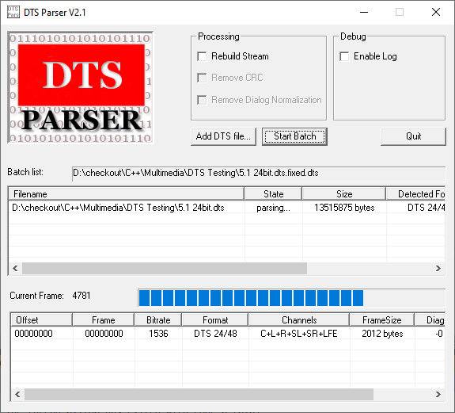

# DTS-parser

## Introduction

DTS is a famous audio format used in many places (DVD, Bluray, CD) allowing multichannel audio at high quality. 

The 1.2.1 specification is available in PDF at ETSI and it is called [ETSI TS 102114: DTS Coherent Acoustics; Core and Extensions](https://www.etsi.org/deliver/etsi_ts/102100_102199/102114/01.02.01_60/ts_102114v010201p.pdf)

This project demonstrate how to parse such format. It is **not** about decompressing the audio. It provides a generic bitstream reader and writer that you can use for other formats (MP2, MP3, AC3...)

This is an old C++ project based on MFC, made around 2006. I updated it to Visual Studio Community 2019.



## DTS streams

DTS can be delivered in many forms:

- As a regular bitstream: each frame start by **0x7FFE8001**
- As a WAV file containing a Big Endian 14 bit bitstream: each frame start by **0x1FFFE800**
- As a WAV file containing a Big Endian 16 bit bitstream: each frame start by **0x7FFE8001**
- As a WAV file containing a Little Endian 14 bit bitstream: each frame start by **0xFF1F00E8**
- As a WAV file containing a Little Endian 16 bit bitstream: each frame start by **0xFE7F0180**

## A generic bitstream parser

The class `BitStreamReader` is a general purpose bitstream reader. You can use it to read 1 or more bit from any file. 

### DTS WAV 

If the file is a WAV, the class `WAVReader` will be used under the hood to load each buffer.

The WAV reader rely on the vintage [Windows Multimedia API](https://docs.microsoft.com/en-us/windows/win32/api/_multimedia/) (mmioOpen,mmioRead,mmioSeek,mmioClose).

- If the DTS WAV is in 16 bit format, we just pass the data to `BitStreamReader` "as is" with `mmioRead`
- if the DTS WAV is in 14 bit format, we must reconstruct the 16 bit format before passing the data the `BitStreamReader` . In this case we use an intermediate private buffer `m_buffer`

Here is the method `WAVReader::ReadDTSStream` taking care of all of this:

```c++
long WAVReader::ReadDTSStream(unsigned char *buffer, long length)
{
	int count = 0;
	if (m_16_bit_mode)
	{
		count = ReadWAVStream((char*)buffer,length);
	}
	else
	{
		short *ptr=(short*)m_buffer;
		while (count!=length)
		{
			if (b==-1)
			{
				if (m_buffer_pos>=m_buffer_size)
				{
					long r = ReadWAVStream(m_buffer,m_buffer_size*2);
					if (r<=0)
						return -1;
					m_buffer_pos = 0;
				}
				v = (ptr[m_buffer_pos++] & 0x3FFF) ; // 14 bits DTS data
				b = 13;
			}
			short mask = (1<<b);
			short bit = v & mask;
			if (bit)
			{
				unsigned char bmask = (1<<bitpos);
				outchar |= bmask;
			}
			bitpos--;
			b--;
			if (bitpos==-1)
			{
				*buffer++ = outchar;
				count++;
				outchar=0;
				bitpos = 7;
			}
		}
	}
	return count; 
}
```

### Regular DTS

`BitStreamReader` read the file using `fopen_s` in binary mode. We use an internal byte buffer called `m_bitbuffer`. Its size is fixed at **2048 bytes** and stored in `m_bitbuffer_size`.

The state of the reader is based on two variables: 

- `m_bytepos`: when it is equal to 2048, it is time to load another buffer
- `m_bitpos`: It start at 7 and decrease to -1. When it is equal to -1, it is time to increment `m_bytepos`

There is also a `m_bitcounter` storing how many bit we have read. So reading bit by bit the stream looks like this:

```c++
int BitStreamReader::ReadBit()
{
	if (m_bitpos==-1)
	{
		m_bytepos++;
		if (m_bytepos == m_bitbuffer_size)
		{
			LoadBuffer();
		}
		m_bitpos = 7;
	}
	int mask = (1<<m_bitpos);
	int bit = m_bitbuffer[m_bytepos] & mask;
	m_bitpos--;
	m_bitcounter++;
	if (m_bitpos==-1)
	{
		m_bytecounter++;
	}
	if (bit!=0)
		return 1;
	else
		return 0;
}
```

From this method we can now provides another one to read multiple bits:

```c++
unsigned int BitStreamReader::ReadBits(int count)
{
	unsigned int v=0;
	unsigned int bit = 0;
	for (int b=0;b<count;b++)
	{
		bit = ReadBit();
		v = (v<<1) | bit;
	}
	return v;
}
```

### End of stream

We raise an exception `EOFBSException` when the end of the stream is reached.

## The DTS parser

The code is located in method `CDTSParserDlg::ParseDTS`, it  simply follows the DTS spec:

```c++
int sync = m_bitstr.ReadBits(32);
if (sync != 0x7FFE8001)
{
    break;
}
//
// Read the frame header
//
int ftype = m_bitstr.ReadBit();
int short_ = m_bitstr.ReadBits(5);
int cpf = m_bitstr.ReadBit();
int nblks = m_bitstr.ReadBits(7);
int fsize = m_bitstr.ReadBits(14);
int amode = m_bitstr.ReadBits(6);
int sfreq = m_bitstr.ReadBits(4);
int rate = m_bitstr.ReadBits(5);
int mix = m_bitstr.ReadBit();
int dynf = m_bitstr.ReadBit();
int timef = m_bitstr.ReadBit();
int auxf = m_bitstr.ReadBit();
int hdcd = m_bitstr.ReadBit();
int ext_audio_id = m_bitstr.ReadBits(3);
int ext_audio = m_bitstr.ReadBit();
int aspf = m_bitstr.ReadBit();
int lff = m_bitstr.ReadBits(2);
int hflag = m_bitstr.ReadBit();
int hcrc = 0;
if (cpf == 1)
    hcrc = m_bitstr.ReadBits(16);
int filts = m_bitstr.ReadBit();
int vernum = m_bitstr.ReadBits(4);
int chist = m_bitstr.ReadBits(2);
int pcmr = m_bitstr.ReadBits(3);
int sumf = m_bitstr.ReadBit();
int suls = m_bitstr.ReadBit();
int dial = m_bitstr.ReadBits(4);
```

## A generic bitstream writer

We also provides a class `BitStreamWriter` to write any bitstream you want (You can't write DTS WAV with it). 

Writing a bit is pretty much similar to reading a bit. The state of the writer is based on two variables: 

- `m_bytepos`: when it is equal to 2048, it is time to write the current buffer
- `m_bitpos`: It start at 7 and decrease to -1. When it is equal to -1, it is time to increment `m_bytepos`

Here the code:

```c++
void BitStreamWriter::WriteBit(int value)
{
	int mask = 0;
	if (value==1)
	{
		mask = 1<<m_bitcount;
	}
	m_bitbuffer[m_bytepos] |= mask;

	m_bitcount--;
	if (m_bitcount==-1)
	{
		m_bitcount = 7;
		m_bytepos++;
		if (m_bytepos==m_bitbuffer_size)
		{
			SaveBuffer();
		}
	}
}
```

Of course when the stream is closed we must flush the remaining bytes in the buffer:

```c++
void BitStreamWriter::Close()
{
	if (m_bitcount!=7)
	{
		SaveBuffer(); // flush the remaining bits to disk
	}
	if (m_id!=NULL)
	{
		fclose(m_id);
		m_id=NULL;
	}

}
```

# Notes about the Visual Studio project

Unicode is disabled as precompiled headers